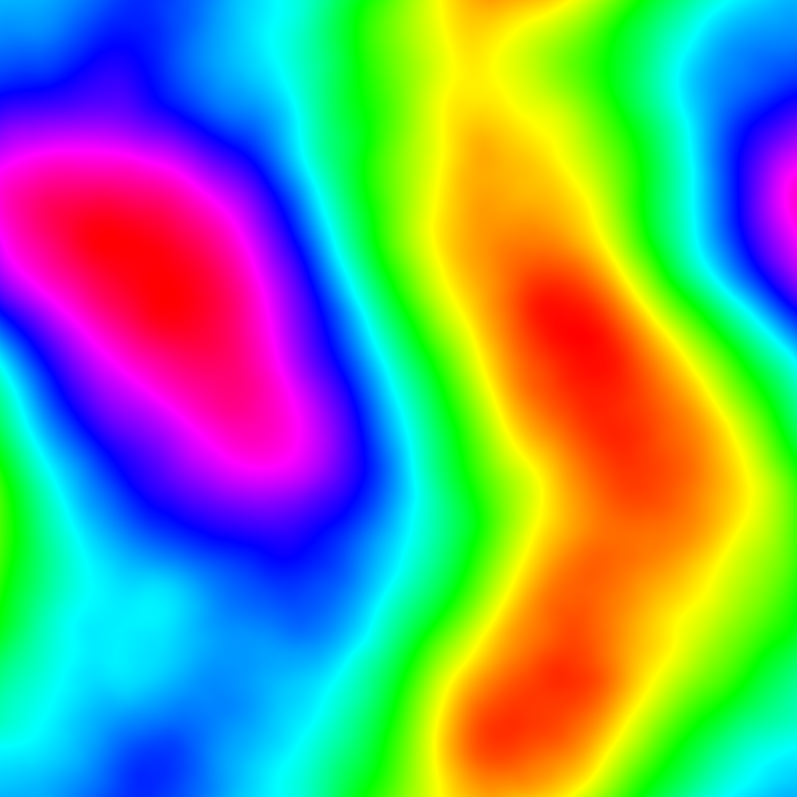

# Fractal Landscapes

Java code to create fractal landscapes.

Based on http://paulbourke.net/fractals/noise/

## Landscapes
Creates fractal landscapes with four display options.

Black and White with continuous gradient:

Color with continuous gradient:

Color with 16 colors:

Colors to look like a relief map:

## Flat Planets
Creates an alien planet looking image by randomly cutting the iamge in half and slightly changing the color.  After 900 iterations it looks like this:

